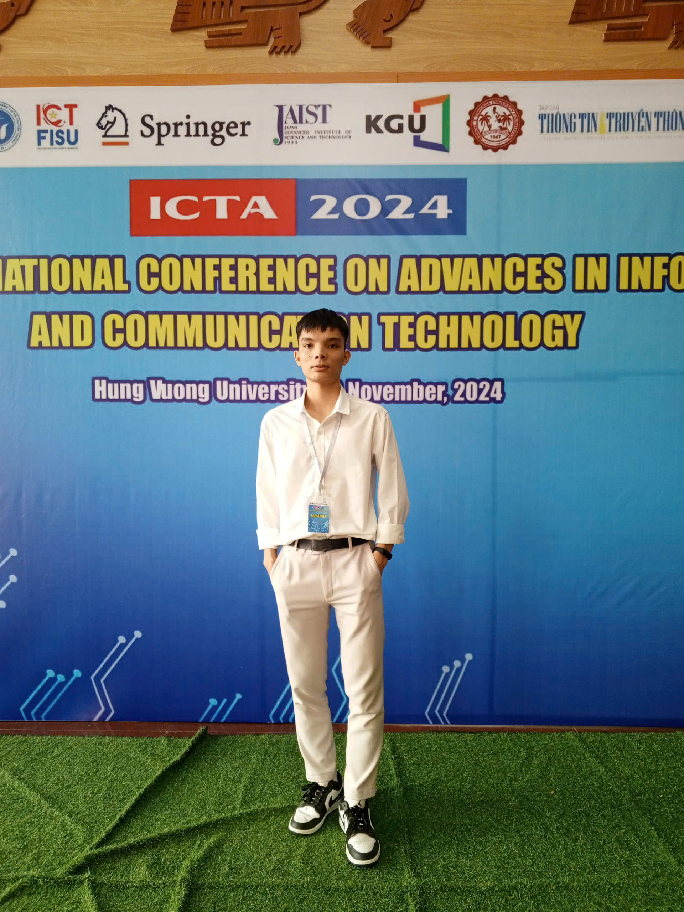

# :heart: Welcome to HocSphere :heart:
---

!!! info "About Me"

    Hello, my name is Hoc. I am a **Machine Learning** and **Computer Vision** engineer. Currently, I am a researcher at the **Institute of Applied Science and Technology (IAST)** in Thai Nguyen, where my work focuses on researching **Machine Learning** and **Deep Learning** techniques and advancing computer vision applications in **healthcare** and **3D imaging**. My goal is to leverage AI and computer vision to create impactful solutions that enhance medical diagnostics and patient care. For more information, please refer to [**my website**](https://nthaihoc.github.io/about-me).

    <figure markdown="span">
        { width="300" }
    <figcaption>This is a picture of me attending the ICTA 2024 conference</figcaption>
    </figure>

!!! danger "Purpose"

    This website is built with the purpose of creating an integrated space where I can record and share study notes, weekly research, and team work schedules. I want this website to become a platform for storing academic materials and work tasks, while encouraging interaction and collaboration among team members. By providing space for scientific notes, research projects, and team work plans, this website will support me and my colleagues in optimizing the learning and working process. It is a place where I gather ideas, share knowledge, and track research progress, thus contributing to fostering creativity and efficiency in team work.

!!! tip "Contact"

    Everyone can contact me through the following information:

    - :material-phone: **Phone**: {++0834265442++}  
    - :material-email-outline: **Email**: [{++thaihoc.ictu@gmail.com++}](mailto:thahoc.ictu@gmail.com)  

 
