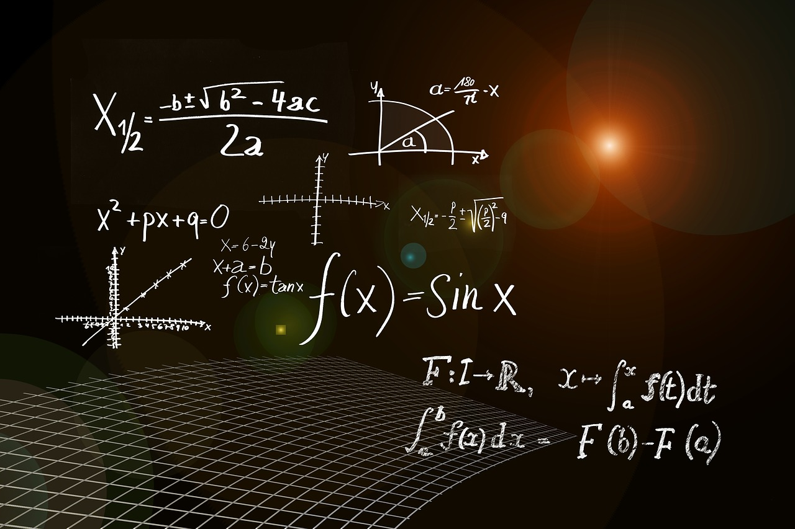

<figure markdown="span">
        { width=88% }
<figcaption></figcaption>
</figure>

---
## i. Overview

This collection of notes provides a comprehensive overview of Linear Algebra, covering fundamental concepts essential for understanding machine learning, data science, and mathematics. Topics include:

- Vectors and Vector Spaces: Basic building blocks and their properties.
- Matrices: Operations, transformations, and solving systems of linear equations.
- Eigenvalues and Eigenvectors: Key concepts for dimensionality reduction and matrix decompositions.
- Linear Transformations: Mappings between vector spaces.

Linear Algebra is crucial for many AI algorithms and data analysis tasks. These notes summarize the core principles and applications, offering both theoretical and practical insights.

---
## ii. Knowledge Base

| No.  | Title | Description | Status | Resources |
| :--: | :---: | :---------- | :----: | :-------: |
|  01  | Introduction to Algebra (Part 1) | Vector and Matrices, Eigenvalues and Eigenvectors, Principle Component Analysis, Singular Value Decomposition | ^^Progress^^ | [**[Notes]**](){:target="blank"} [**[Code]**](){:target="blank"} |

## iii. Resources

 