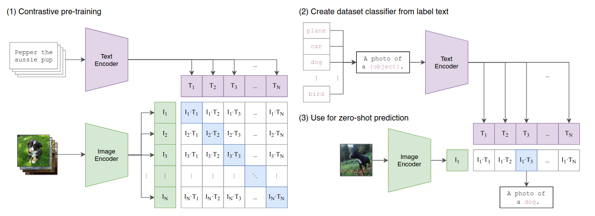

# :material-note-edit-outline: Vision Language Model - VLM
---

## Contents

- [**I. The problem**](#i-the-problem)
- [**II. Overview of the VLM**](#ii-overview-of-the-vlm)
- [**III. CLIP model (Contrastive Language-Image Pretraining)**](#iii-clip-model-contrastive-language-image-pretraining)
- [**IV. Flamingo model**](#iv-flamingo-model)

## I. The problem
## II. Overview of the VLM
## III. CLIP model (Contrastive Language-Image Pretraining)
==**1. Overview**==

**Information:** The CLIP model was introduced in Jan, 2020 by OpenAI with paper title {++"Learning Transferable Visual Models from Natural Language Supervision"++}. This is a highlight architecture in combining language and image learning, opening up zero-shot learning for a wide range of computer vision tasks.

**Objectives of Model:** 

- Training the model to predict which caption matches which image on a dataset of 400 million pair (image, text), developed an efficient image representation learning model from scratch. 

- Then the training, can use natural language to refer to or describe visual concepts, allowing zero-shot transfer to a variety of tasks.

**Results achieved:** The model was evaluated on more than 30 datasets: character recognition, video action, geolocation and fine-grained object classification. Model performed competitively with supervised training methods, accuracy comparable to ResNet-50 on ImageNet without using its training set.

==**2. Architecture model**==

<figure markdown="span">
    {width=100%}
</figure>

**Image encoder:** Use ResNet50, ResNetD and ViT as the base architecture for the image encoder. Replace the GAP layer with an attention pooling mechanism - transformer style (multi-head QKV). 

**Text encoder:** 

- Transformer with the architecture modifications: 63M-parameter, 12-layer 512-wide model with 8 attention heads. 

- Text converted to token by BPE with a 49.152 vocab size and sequence length at 76.

**Multi-model embedding space:** Both image feature and text feature are layer normalized, then linearly projected into the multi-model embedding space to calculate the similarity between images and descriptions.

==**3. Zero-shot transfer**==

^^Progress:^^

1. Use image encoder to get image embedding, use text encoder to get embeddings for all class names.
2. CLIP computes cosine similarities between the image and text embeddings, scales them by a temperature parameter, then applies softmax to get probabilities. This works like a softmax classifier where both the inputs and class embeddings are L2-normalized, there's no bias term, and temperature controls the sharpness of the output. 

^^Multinomial logistic regression classifier:^^

$$\text{logit}_{i} = f_\text{img} \cdot f_\text{text, i}$$

where:

- $f_\text{img}$ is embedding image / inputs
- $f_\text{text, i}$ is embedding of text $i$ / weights
- $\text{logit}_{i}$ is cosine similarity. 

Devide the logits by a temperature ($\tau$) coefficient. Then pass it through softmax to get the classification probabilities.

$$P_{i} = \frac{e^{logit_i / \tau}}{\sum_{j}e^{logit_j / \tau}}$$

## IV. Flamingo model
## V. Experimental strategy for Cervical Cancer Cytology

