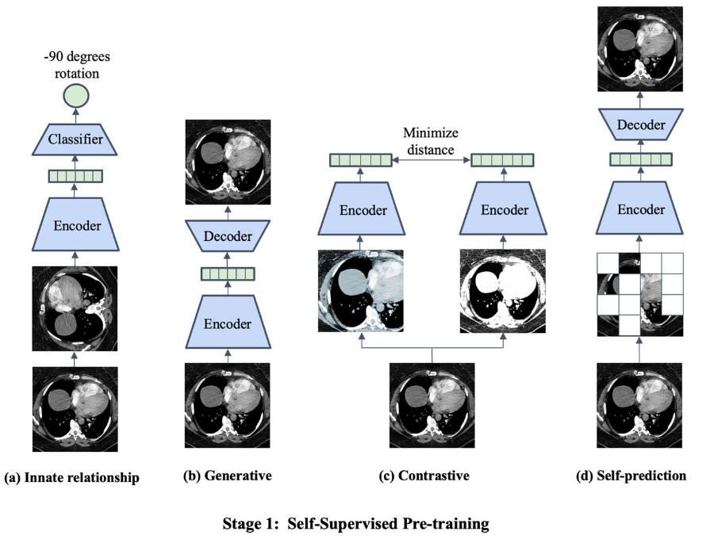

# Self-Suppervised Learning for medical image classification
---

{==Papers Review==}: [Link]({{research.mate01}})

## I. Introduction

!!! info "Self Supervised Learning ?"

    - Self-Supervised Learning (SSL) hay còn gọi là học tự giám sát là quá trình đào tạo các mô hình học sâu để học hỏi các biểu diễn có ý nghĩa từ dữ liệu bằng cách sử dụng các dữ liệu không có nhãn.
    - SSL có thể tạo ra các mô hình tổng quát, tinh chỉnh cho từng nhiệm vụ mà không cần dữ liệu được chú thích nhãn.

## II. Terminology and strategies in SSL

Có 4 loại chiến lược chính trong SSL: **innate relationship**, **generative**, **contrastive**, và **self-prediction**: 

<figure markdown="span">
  { width="500" }
  <figcaption>Strategies type in the Self-Supervised Learning (SSL)</figcaption>
</figure>

1. **Innate relationship** (mối quan hệ nội tại)

    - Thay vì đào tạo trước một mô hình trên tập dữ liệu có nhãn, phương pháp này sẽ tạo ra một tác vụ tiền huấn luyện thủ công (pretext task) dựa trên các đặc điểm nội tại của dữ liệu mà không cần yêu cầu nhãn bên ngoài. Các tác vụ này tận dụng mối quan hệ tự nhiên trong dữ liệu để huấn luyện mô hình, giúp trích xuất và học các đặc trưng quan trọng. Các pretext task do con người thiết kế ra ví dụ dự đoán góc xoay ảnh, cắt ảnh thành các mảnh nhỏ và sắp xếp lại.
    - {++Hạn chế++}: Do được thiết kế thủ công bởi con người, nên đôi khi sẽ chỉ phù hợp với dữ liệu cụ thể, không khai thác được tối đa tiềm năng từ dữ liệu.

2. **Generative** (sinh dữ liệu)

    - Phương pháp này được sử dụng để hiểu và tái tạo phân phôi của dữ liệu huấn luyện. Chúng sử dụng dữ liệu có sẵn làm mục tiêu để tự động học hỏi các biểu diễn ẩn (latent representations) mà không cần nhãn cụ thể. Ví dụ như autoencoders, GAN. 

3. **Contrastive** (đối lập)

    - Phương pháp này dựa trên giả định rằng các biến đổi (augumentatios) của một ảnh không làm thay đổi ỹ nghĩa nghữ nghĩa của chúng:
    - Hai khái niệm quan trọng trong phương pháp này là positive pairs (cặp dương) và negative pairs (cặp âm).
    - Ví dụ positive pairs: là các phiên bản khác nhau của cùng một ảnh (một bức ảnh gốc và phiên bản xoay của chúng)
    - Ví dụ negative pairs: là các ảnh khác nhau, bao gồm cả các augumentations của chúng.
    - Mục tiêu của mô hình là: thu hẹp khoảng cách giữa các cặp dương và tăng khoảng cách giữa cặp âm.
    - Cách tiếp cận và tối ưu hóa: Dựa trên các metric như cosine similarity hoặc euclidean distance đẻ đo và tối ưu hóa khoảng cách giữa các cặp âm và dương.
    - Một số phương pháp nổi bật: SimCLR, MoCo(Momentum Contrats), DINO, BYOL, SimSiam, cluster-based contrastive learning.
    - {++Ưu điểm++}: không cần nhãn, sử dụng augumentations để tự học, tận dụng các đặc điểm ngữ nghĩa của dự liệu gốc.
    - {++Nhược điểm++}: Cần tối ưu hóa nhiều để giải quyết các bài toán mẫu âm, tốn tài nguyên tính toán vì phải lưu trữ nhiều. 

4. **Self-prediction**

    - Là một phương pháp học sử dụng chiến lược che (masking) hoặc tăng cường (augmenting) một phần của dữ liệu đầu vào và dùng các phần không bị che để dự đoán và tái dựng lại dữ liệu gốc. Ý tưởng này xuất phát từ NLP cụ thể là mô hình BERT.
    - {++Ưu điểm++}: Học biểu diễn mạnh mẽ hơn, kế thứa sức mạnh từ NLP, các biểu diễn học được có thể được tinh chỉnh để giải quyết nhiều bài toán thị giác khác nhau như phân loại, nhận diện đối tượng, phân đoạn.

## III. Strategies fine-tune model in SSL methods

1. End-to-end fine-tuning

    - Tất cả các trọng số của mô hình được tinh chỉnh (bao gồm cả encoder và classifier).
    - Trong giai đoạn fine-tuning, các trọng số này sẽ được tối ưu hóa thông qua học có giám sát.

2. Feature Extraction

    - Trọng số của encoder được giữ nguyên và chỉ được sử dụng để trích xuất đặc trưng từ dữ liệu.
    - Các đặc trưng sẽ được đưa vào một bộ phân loại mới như: Linear classifier, SVM, KNN, .v.v.

3. SSL (task-agnostic)

    - Giai đoạn pre-training của SSL học các đặc trưng tổng quát từ dữ liệu, không điều chỉnh cho một bài toán cụ thể nào.
    - Sau khi pre-traning có thể fine-tune cho các bài toán như phân loại, phát hiện đối tượng, phân đoạn mà không cần phải thay đổi cách pre-traning ban đầu.

## IV. Overview

Bảng khảo sát về các nghiên cứu SSL với dữ liệu dạng WSI.

| Year | Domain | Outcome | SSL strategies | Metrics | SSL performance | 
| :--: | :----: | :------ | :------------: | :-----: | :-------------: |
| 2021 | Pathology | Coloretal cancer, stomach cancer and breast cancer | Genarative, Contrastive | Accuracy | 0.91 |
| 2021 | Pathology | Coloretal cancer and healthy tissue types | Generative, Contrastive | Accuracy | 0.914 |
| 2020 | Ophthalmology | Glaucoma | Contrastive | Accuracy | 0.923 | 
| 2020 | Pathology | Lung cancer and healthy tissue types | Contrastive | AUROC | 0.963 |
| 2020 | Pathology | Breast cancer | Contrastive | AUROC | 0.987 |
| 2020 | Pathology | Colorectal cancer and healthy tissue types | Contrastive | F1 | 0.914 |
| 2021 | Pathology | Microsatellite instability | Contrastive | AUROC | 0.88 |
| 2021 | Pathology | Breast cancer | Contrastive | AUROC | 0.978 |
| 2021 | Pathology | Celiac disease | Contrastive | AUROC | 0.937

## V. Quick Implementation Results and Future Planning

Thử nghiệm với kích thước ảnh là 256, sử dụng phương pháp contrastive (cụ thể là mô hình SimCLR) và chiến lược end-to-end fine-tuning thu được kết quả sau:

| Model | Image Size | Accuracy | F1-Score | Precision | Recall |
| :---: | :--------: | :------: | :------: | :-------: | :----: |
| SimCLR | 256 | 70.95 | 72.42 | 72.99 | 73.65 |

Kế hoạch thực nghiệm trong tương lai:

- Thử nghiệm nhanh trên nhiều models khác trong phương pháp contrastive.
- So sánh hiệu suất, tỷ lệ dự đoán của mô hình trên các nhãn lớp so với hiệu suất của mô hình ensemble learning (đã được huấn luyện trước đó)
- Mở rộng nghiên cứu cho bài toán phát hiện đối tượng cụ thể là dữ liệu WSI.

---
