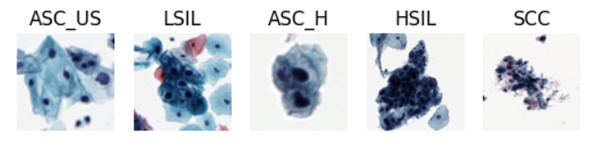

# Research Notes
---

> ```Research notes - ghi chú nghiên cứu, là nơi tôi tổng hợp lại những ghi chú, kiến thức, và tài liệu được xây dựng từ các dự án thực tế và quá trình tự nghiên cứu cá nhân, nhằm phục vụ việc học tập, phân tích và phát triển giải pháp.```


## :material-list-status: Research Topics

<div class="grid cards" markdown>

-   :health_worker:{ .lg .middle } __Cervical Cancer Cytology - Tế bào học Ung thư cổ tử cung__

    ---
    

    [^^:octicons-arrow-right-24: Xem thêm^^](../research-logs/cervical-cancer-cytology.md)

-   :health_worker:{ .lg .middle } __Tế bào học Ung thư cổ tử cung (Cervical Cancer Cytology)__

    ---
    

    [^^:octicons-arrow-right-24: Xem thêm^^](../research-logs/cervical-cancer-cytology.md)

</div>


